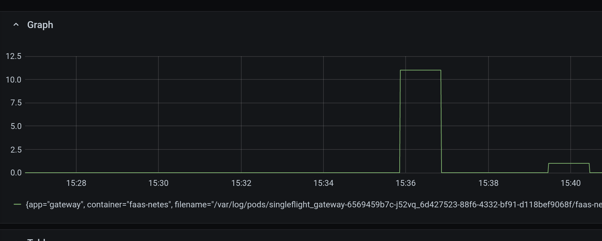
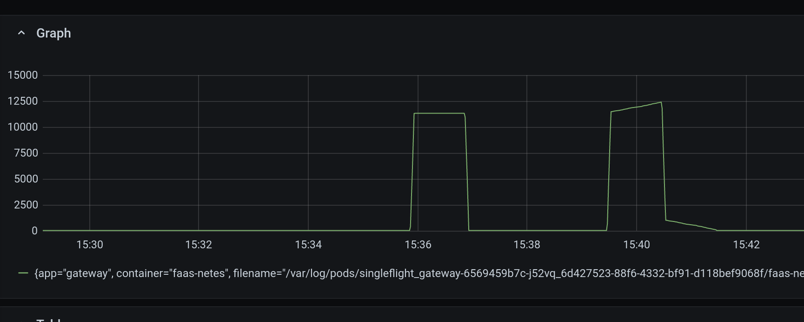
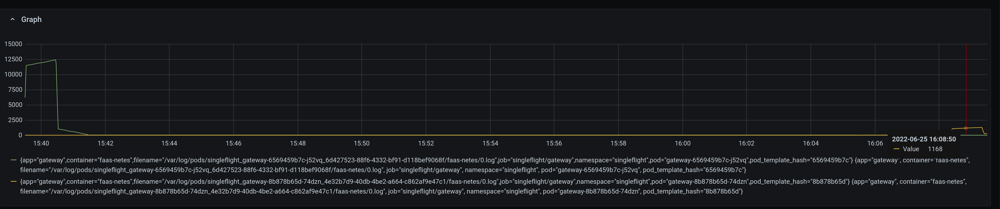
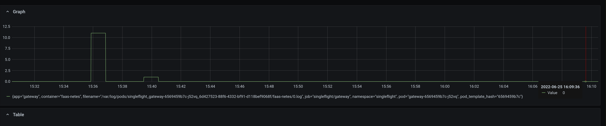

# OpenFaaS Gateway PR 1734: Singleflight for provider requests

## Setup

First we setup some monitoring using Grafana and Loki. We are going to use Loki's ability to covert logs into metrics because the OpenFaaS gateway does not currently emit or expose metrics for the underlying provider (this could be/is future work).

```sh
export NAMESPACE=singleflight

kubectl create namespace singleflight
kns $NAMESPACE

arkade install grafana -n $NAMESPACE
arkade install loki -n $NAMESPACE
arkade install openfaas -n $NAMESPACE --set functionNamespace=$NAMESPACE --set createCRDs=false

kubectl create ing openfaas --rule="$NAMESPACE.prod.contiamo.io/*=gateway:8080,tls=$NAMESPACE-tls" --annotation="cert-manager.io/cluster-issuer=letsencrypt-production-route53" --class=nginx
```

Don't forget to grab the password

```sh
export OPENFAAS_URL=$NAMESPACE.prod.contiamo.io
PASSWORD=$(kubectl get secret -n $NAMESPACE basic-auth -o jsonpath="{.data.basic-auth-password}" | base64 --decode; echo)
echo -n $PASSWORD | faas-cli login --gateway=$OPENFAAS_URL --username admin --password-stdin --tls-no-verify
```

Now we can actually deploy a sample function and generate some data.

```sh
faas-cli store deploy --gateway=$OPENFAAS_URL env
```

First we create some load using `hey`

```sh
kubectl scale -n $NAMESPACE deploy/env --replicas=0
hey -c 300 -z 60s https://$OPENFAAS_URL/function/env
```

We are interested in the replica checking and setting behavior of the provider. We can monitor this in Grafana using the following Loki queries

This query will detect multiple (failed) attempts by the provider to scale up the deployment. These failures occur because we have multiple parallel requests and alert triggers that cause the provider to repeatedly scale the function

```loki
count_over_time({container="faas-netes",namespace="singleflight"} |= "cannot be fulfilled on deployments.apps \"env\""[1m])
```



The following query shows the number of replica checks for the `env` function

```loki
count_over_time({container="faas-netes",namespace="singleflight"} |= "Replicas: env"[1m])
```



## Apply the patch

To redeploy with the patched gateway, we can use this arkade comamnd

```sh
arkade install openfaas -n $NAMESPACE --set functionNamespace=$NAMESPACE --set createCRDs=false --set gateway.image=docker.io/alexellis2/gateway:single14
```

Once the rollout is finished, we can re-run `hey` to generate more data.

```sh
kubectl scale -n $NAMESPACE deploy/env --replicas=0
hey -c 300 -z 60s https://$OPENFAAS_URL/function/env
```

Let's start with the replica count checks for `env`

```loki
count_over_time({container="faas-netes",namespace="singleflight"} |= "Replicas: env"[1m])
```



Here we can see the tail end of the first request and we can then see a _much_ smaller bump for the new version, it is ~10 times less.

One thing worth pointing out is that this query shows _two_ lines because the data comes from two different pod instances. As a result we see a green line for the old unpatched deployment and a yellow line for the new patched deployment. Grafana fills in `0` for the time periods with missing data.

Now we look at the error count

```loki
count_over_time({container="faas-netes",namespace="singleflight"} |= "cannot be fulfilled on deployments.apps \"env\""[1m])
```



One thing should immediately standout, there is only one line. This represents data from the original instance. However, based on this it means that the error message _never_ occurred in the new instance, when an instance generates _no matching log lines_ it will be omitted from the results completely. This means we could imagine a yellow line that is just `0` for the entire time period!

This is a huge success for this patch. We wanted to elimate the errors and reduce repeated and uneccessary load on the provider and the cluster.

Equally important is that `hey` reports _no_ error responses from the the function. First, from before the patch

```sh
$ hey -c 300 -z 60s https://$OPENFAAS_URL/function/env
Summary:
  Total:	60.3604 secs
  Slowest:	5.0883 secs
  Fastest:	0.0295 secs
  Average:	0.4072 secs
  Requests/sec:	734.4547

  Total data:	41692020 bytes
  Size/request:	940 bytes

Response time histogram:
  0.030 [1]	|
  0.535 [37216]	|■■■■■■■■■■■■■■■■■■■■■■■■■■■■■■■■■■■■■■■■
  1.041 [4433]	|■■■■■
  1.547 [2378]	|■■■
  2.053 [2]	|
  2.559 [2]	|
  3.065 [0]	|
  3.571 [0]	|
  4.077 [0]	|
  4.582 [53]	|
  5.088 [247]	|


Latency distribution:
  10% in 0.0605 secs
  25% in 0.1164 secs
  50% in 0.3889 secs
  75% in 0.4225 secs
  90% in 0.8476 secs
  95% in 1.1395 secs
  99% in 1.4122 secs

Details (average, fastest, slowest):
  DNS+dialup:	0.0028 secs, 0.0295 secs, 5.0883 secs
  DNS-lookup:	0.0009 secs, 0.0000 secs, 0.1316 secs
  req write:	0.0000 secs, 0.0000 secs, 0.0048 secs
  resp wait:	0.4040 secs, 0.0295 secs, 4.8917 secs
  resp read:	0.0002 secs, 0.0000 secs, 0.0741 secs

Status code distribution:
  [200]	44332 responses

```

and after the patch

```sh
$ hey -c 300 -z 60s https://$OPENFAAS_URL/function/env
Summary:
  Total:	60.3527 secs
  Slowest:	5.2870 secs
  Fastest:	0.0304 secs
  Average:	0.4230 secs
  Requests/sec:	706.9107

  Total data:	40121280 bytes
  Size/request:	940 bytes

Response time histogram:
  0.030 [1]	|
  0.556 [38094]	|■■■■■■■■■■■■■■■■■■■■■■■■■■■■■■■■■■■■■■■■
  1.082 [1723]	|■■
  1.607 [2540]	|■■■
  2.133 [5]	|
  2.659 [1]	|
  3.184 [0]	|
  3.710 [0]	|
  4.236 [0]	|
  4.761 [162]	|
  5.287 [138]	|


Latency distribution:
  10% in 0.0659 secs
  25% in 0.1810 secs
  50% in 0.3975 secs
  75% in 0.4244 secs
  90% in 0.5828 secs
  95% in 1.2530 secs
  99% in 1.4577 secs

Details (average, fastest, slowest):
  DNS+dialup:	0.0029 secs, 0.0304 secs, 5.2870 secs
  DNS-lookup:	0.0008 secs, 0.0000 secs, 0.1188 secs
  req write:	0.0000 secs, 0.0000 secs, 0.0023 secs
  resp wait:	0.4197 secs, 0.0303 secs, 4.9249 secs
  resp read:	0.0002 secs, 0.0000 secs, 0.0366 secs

Status code distribution:
  [200]	42664 responses

```
