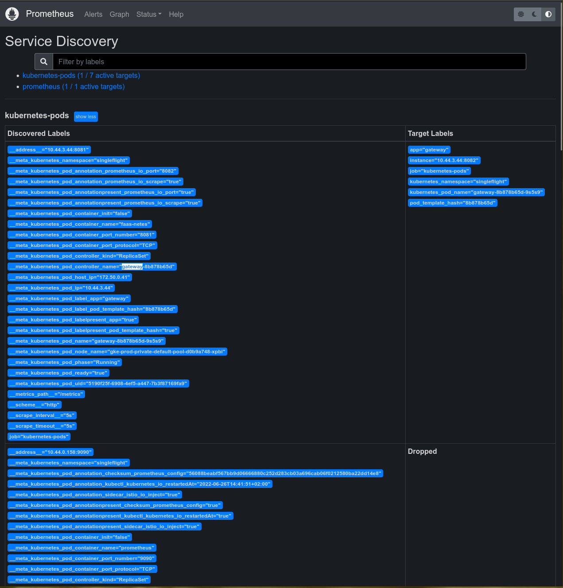

- [Experiment to collect Provider metrics](#experiment-to-collect-provider-metrics)
  - [Prometheus configuration](#prometheus-configuration)
  - [Patching the config: Attempt 1](#patching-the-config-attempt-1)
  - [Potential Solution: 1](#potential-solution-1)
    - [Potential Downsides 1](#potential-downsides-1)
  - [Attempt 2](#attempt-2)
    - [Failure](#failure)
  - [Attempt 3](#attempt-3)
  - [Conclusion](#conclusion)

# Experiment to collect Provider metrics

Over in my testing of [#1734 singleflight in the Gateway](../../gateway/1734-singleflight/README.md) I mentioned the fact that the current deployments of `faas-netes` does not expose or collect metrics from the `faas-netes` provider. It turns out that for ad-hoc testing and experiments we can work around this with a tool like [Loki](https://grafana.com/oss/loki/).

In this experiment we play with the Prometheus configuration to show that we _could_ directly scrape the provider metrics if it was exposed as a Service in the cluster.

## Prometheus configuration

Obviously the first thing we need to understand is _how_ prometheus is configured. The _easiest_ way to deal with Prometheus service discovery in Kubernetes is probably the Prometheus Operator, however, the faas-netes project wants to reduce the number of dependencies and many people do not want to install an operator for just a single application. This means managing the prometheus configuration directly.

This is done in the [helm chart](https://github.com/openfaas/faas-netes/blob/master/chart/openfaas/templates/prometheus-cfg.yaml).

The cool thing about Prometheus (and Kubernetes) is that it has various modes of service discovery built in. We currently use `pod` based discovery which is [documented here](https://prometheus.io/docs/prometheus/latest/configuration/configuration/#pod). There are a couple things worth noting

> The `pod` role discovers all pods and exposes their containers as targets. For each declared port of a container, a single target is generated. If a container has no specified ports, a port-free target per container is created for manually adding a port via relabeling.

First, "For each declared port of a container, a single target is generated." This is great news, we have a single Pod with two containers `gateway` and `faas-netes`, we want to scrape both. This means that prometheus service discovery _wants_ to scrape both, as long as we don't get in the way :)

Second thing to note is that list of meta labels that are available. In prometheus the metrics name + labels completely determine the timeseries, so these labels are very important.

One of the things that is _very_ common when configuring Prometheus is to mutate, rename, or even drop some of these labels. The other thing to know is that this config behaves like a pipeline of mutations and the order is important, we will need this later. The default OpenFaaaS scrape configuration looks like this

```yaml
- job_name: kubernetes-pods
  honor_timestamps: true
  scrape_interval: 5s
  scrape_timeout: 5s
  metrics_path: /metrics
  scheme: http
  follow_redirects: true
  enable_http2: true
  relabel_configs:
    - separator: ;
      regex: __meta_kubernetes_pod_label_(.+)
      replacement: $1
      action: labelmap
    - source_labels: [__meta_kubernetes_namespace]
      separator: ;
      regex: (.*)
      target_label: kubernetes_namespace
      replacement: $1
      action: replace
    - source_labels: [__meta_kubernetes_pod_name]
      separator: ;
      regex: (.*)
      target_label: kubernetes_pod_name
      replacement: $1
      action: replace
    - source_labels: [__meta_kubernetes_pod_annotation_prometheus_io_scrape]
      separator: ;
      regex: "true"
      replacement: $1
      action: keep
    - source_labels:
        [__address__, __meta_kubernetes_pod_annotation_prometheus_io_port]
      separator: ;
      regex: ([^:]+)(?::\d+)?;(\d+)
      target_label: __address__
      replacement: $1:$2
      action: replace
    - source_labels: [__meta_kubernetes_pod_annotation_prometheus_io_path]
      separator: ;
      regex: (.+)
      target_label: __metrics_path__
      replacement: $1
      action: replace
```

The part you want to understand is the [`relabel_configs` which means reading the docs](https://prometheus.io/docs/prometheus/latest/configuration/configuration/#relabel_config). If you quickly double check the list of `source_labels` you will notice that _none_ of them mention the container. The consequence is that even if Prometheus tried to scrape both containers there could be duplicate metrics because the container name would be missing, to Prometheus it would look like a duplicate.

The prometheus UI is very helpful for inspecting its own configuration and behavior. It includes UIs for the current configuration, the current scrape targets, and the current service discovery, among other status information. We are going to start with the service discovery UI to see how this is understood by Prometheus.



This UI shows us what services our `kubernetes-pod` configuration found and how the meta labels were translated into actual metric labels. It may not be obvious in this screenshot, but if you look through the services for the Service Discovery of standard OpenFaaS deployment, you will see that there is only _one_ service for the the `app=gateway` label.


If you look at the "discovered labels" column, you can see the available metadata, this [matches the docs](https://prometheus.io/docs/prometheus/latest/configuration/configuration/#pod).


The interesting thing here is that when you look closely at the `__meta_kuberenetes_pod_container_name` it says `faas-netes`! This works out because the pod only exposes a single port with metrics.

## Patching the config: Attempt 1

We want to scrape our `gateway` pod multiple times, once for each container. One way to do this is to include the container name in the relabel config. This will change how Prometheus handles the service discover, creating separate targets for the `gateway` and `faas-netes` containers, because the labels are distinct now.

```yaml
- job_name: kubernetes-pods
  honor_timestamps: true
  scrape_interval: 5s
  scrape_timeout: 5s
  metrics_path: /metrics
  scheme: http
  follow_redirects: true
  enable_http2: true
  relabel_configs:
    - separator: ;
      regex: __meta_kubernetes_pod_label_(.+)
      replacement: $1
      action: labelmap
    - source_labels: [__meta_kubernetes_namespace]
      separator: ;
      regex: (.*)
      target_label: kubernetes_namespace
      replacement: $1
      action: replace
    - source_labels: [__meta_kubernetes_pod_name]
      separator: ;
      regex: (.*)
      target_label: kubernetes_pod_name
      replacement: $1
      action: replace
    - source_labels: [__meta_kubernetes_pod_annotation_prometheus_io_scrape]
      separator: ;
      regex: "true"
      replacement: $1
      action: keep
    - source_labels:
        [__address__, __meta_kubernetes_pod_annotation_prometheus_io_port]
      separator: ;
      regex: ([^:]+)(?::\d+)?;(\d+)
      target_label: __address__
      replacement: $1:$2
      action: replace
    - source_labels: [__meta_kubernetes_pod_annotation_prometheus_io_path]
      separator: ;
      regex: (.+)
      target_label: __metrics_path__
      replacement: $1
      action: replace
    - source_labels: [__meta_kubernetes_pod_container_name]
      action: replace
      target_label: kubernetes_container_name
```

Here we sipmly extended the previous `relabel_config` with this extra rule

```yaml
- source_labels: [__meta_kubernetes_pod_container_name]
  action: replace
  target_label: kubernetes_container_name
```

Now, in the Service Discovery UI we can see _two_ services are discovered for the Gateway.


We can clearly see a target with `kubernetes_container_name="gateway"` and `kubernetes_container_name="faas-netes"`.

When we look at the Targets status UI we can see _two_ scrape targets


But we have a problem now ... If you look closely, they are using the same ip address and port! This will just generate the same data, it is just sending it to the same `gateway` endpoint because of the `prometheus.io/port: 8082` Pod annotation. If we remove this annotation we will get two distinct targets, recall from the docs that Prometheus will automatically generate a target for each exposed port


Of course, this is a problem because the gateway doesn't expose metrics on the public port, the metrics are on `8082`. Hence, the 404 in the screenshot.

## Potential Solution: 1

Move the metrics endpoint. If we move the Gateway metrics to the server port `8081`, this configuration will start to work.

At the same time, we add a `/metrics` endpoint to the `faas-netes` provider and [Bob's your uncle](https://en.wikipedia.org/wiki/Bob%27s_your_uncle)

### Potential Downsides 1

There are two potential concerns with this approach. Obviously there is the effort to move existing implementations without breaking anything. This would be a big change, fortunately, we do not expose the internal prometheus as a "public" component, so it should only be a concern for the Gateway and Provider implementations.

The other issue is the labels. Both the Gateway and the Provider will still have the `app=gateway` label. Once the Provider is generating metrics, it will require changing any dashboard or alerts to include the new `kubernetes_container_name` metric to split out the Gateway from the Provider. Again this is a breaking change that needs to be handled.

We can potentially workaround the labelling issue by adding more steps to the `relabel_config`. Recall that this config behaves like a pipeline of mutations and the order is important. This means we can use the container name as the `app` label and then remove this label, if it happens to exist. We can also just remove the label.

```yaml
- separator: ;
  source_labels: [__meta_kubernetes_pod_container_name]
  target_label: app
  action: replace
- separator: ;
  regex: __meta_kubernetes_pod_label_app$
  action: labeldrop
```

The full config looks like this

```yaml
- job_name: kubernetes-pods
  honor_timestamps: true
  scrape_interval: 5s
  scrape_timeout: 5s
  metrics_path: /metrics
  scheme: http
  follow_redirects: true
  enable_http2: true
  relabel_configs:
    - separator: ;
      source_labels: [__meta_kubernetes_pod_container_name]
      target_label: app
      action: replace
    - separator: ;
      regex: __meta_kubernetes_pod_label_app$
      action: labeldrop
    - separator: ;
      regex: __meta_kubernetes_pod_label_(.+)
      replacement: $1
      action: labelmap
    - source_labels: [__meta_kubernetes_namespace]
      separator: ;
      regex: (.*)
      target_label: kubernetes_namespace
      replacement: $1
      action: replace
    - source_labels: [__meta_kubernetes_pod_name]
      separator: ;
      regex: (.*)
      target_label: kubernetes_pod_name
      replacement: $1
      action: replace
    - source_labels: [__meta_kubernetes_pod_annotation_prometheus_io_scrape]
      separator: ;
      regex: "true"
      replacement: $1
      action: keep
    - source_labels:
        [__address__, __meta_kubernetes_pod_annotation_prometheus_io_port]
      separator: ;
      regex: ([^:]+)(?::\d+)?;(\d+)
      target_label: __address__
      replacement: $1:$2
      action: replace
    - source_labels: [__meta_kubernetes_pod_annotation_prometheus_io_path]
      separator: ;
      regex: (.+)
      target_label: __metrics_path__
      replacement: $1
      action: replace
    - source_labels: [__meta_kubernetes_pod_container_name]
      action: replace
      target_label: kubernetes_container_name
```

Using this we have the following labels, you can see two different `app` lables in this screenshot.


With this approach we should avoid the complications of adding the `container_name` label to the metrics.

## Attempt 2

The interesting thing about Kubernetes service discovery for Prometheus is that there are _multiple_ ways to discover a service. We only really discussed the `pods` discovery so far, but it is possible to also discover via `service` or `endpoints` API, [among others](https://prometheus.io/docs/prometheus/latest/configuration/configuration/#kubernetes_sd_config).

### Failure

The next thing to consider is can we use Services? This isn't actually going to work because using `service` for the role, ie for service discovery, means it will only discover a single cluster ip address


Here the default discover is the DNS _name_ not ip addresses for each node. This just is not going to work if you have multiple instances.

To generate this screenshot, I add this new scrape job to the configuration

```yaml
- job_name: "k8s-svc"
  scrape_interval: 5s
  honor_labels: false
  kubernetes_sd_configs:
    - role: service
      namespaces:
        names:
          - singleflight
  relabel_configs:
  - action: labelmap
      regex: __meta_kubernetes_service_label_(.+)
  - source_labels: [__meta_kubernetes_namespace]
      action: replace
      target_label: kubernetes_namespace
  - source_labels: [__meta_kubernetes_service_name]
      action: replace
      target_label: kubernetes_svc_name
  - source_labels: [__meta_kubernetes_service_annotation_prometheus_io_scrape]
      action: keep
      regex: true
  - action: replace
      regex: (.+)
      source_labels:
      - __meta_kubernetes_pod_annotation_prometheus_io_path
      target_label: __metrics_path__
  - source_labels:
      [__address__, __meta_kubernetes_service_annotation_prometheus_io_port]
      separator: ;
      regex: ([^:]+)(?::\d+)?;(\d+)
      target_label: __address__
      replacement: $1:$2
      action: replace
```

This configuration then requires adding these annotations to the Service object

```yaml
prometheus.io/scrape: "true"
prometheus.io/port: "8081"
```

## Option 3

The other options are to use the [`endpoints` or `endpointslice`](https://prometheus.io/docs/prometheus/latest/configuration/configuration/#endpoints). This will discover all of the instances, as long as we have defined a service for the metrics scraping. We will have to define `gateway-metrics` and `provider-metrics` Services so that endpoints are created for us.

You essentially have the same configuration as above, replacing `service` with `endpoint` and then creating 2 new services, one per metrics endpoint that you want to scrape.

The one thing I don't like about this is that these Services aren't really otherwise used. Just looking at the networking configuration it isn't obvious why they should be there and it still requires exposing the metrics endpoint to the rest of the cluster. This is one nice thing about the `pods` based discovery, there are no "artificial" Services created.

## Option 4

This last option is clearly not something we want to consider, but we could split the Gateway and Provider into separate Pods! Obviously, one of the benefits of having the Gateway and Provider in the same pod is that it should reduce _some_ networking overhead by allowing us to communicate over localhost, no DNS lookups needed. As such, we can probably just ignore this option, but it is worth recording for posterity.

## Conclusion

Starting from scratch, I would just move the `/metrics` endpoints to the main HTTP port and use the configuration from option 1.
